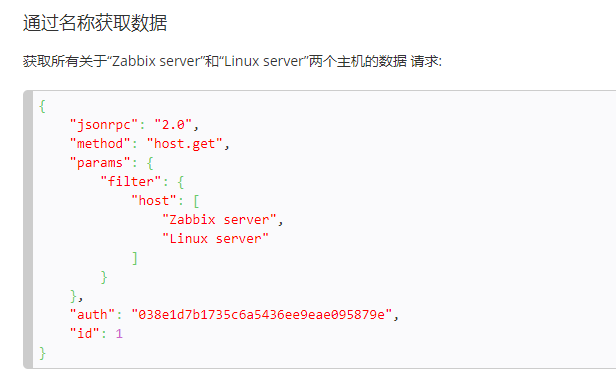
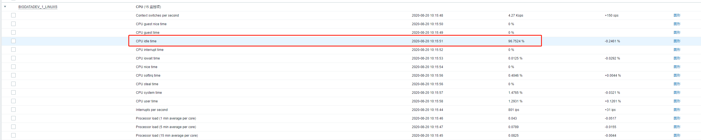
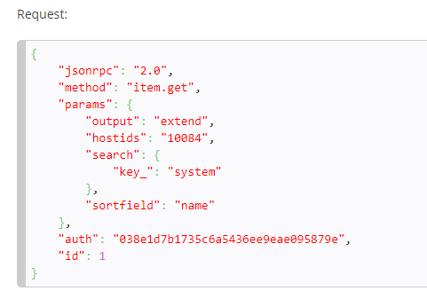

# 说明

## 服务启动

```
执行python main.py [zabbixIP]即可启动后台服务
```

启动之后访问`localhost:5000/test`能查看到如下页面即代表服务正常


## example

### 1.获取指定名称的host信息

在zabbix官方api文档[https://www.zabbix.com/documentation/4.0/zh/manual/api]中找到查询host信息的api(host.get[主机->获取])，可以看到请求参数为



首先使用login()进行鉴权，这个操作即给我们的请求参数附带了auth的值

请求参数的method为host.get,所以我们调用的时候使用zapi.host.get()方法即可发送相应的请求，

请求参数中使用了filter，所以在get后的括号内填入filter=xxx（填入的值为请求参数的内容，例如官方模板中为{'host':['zabbix server','Linux server']})，我们只查询名称为`BIGDATADEV_1_LINUXS`的Host相关的信息所以我们填入参数{'host': ['BIGDATADEV_1_LINUXS']}


**总结**

method是什么，就使用zapi.xxx来调用对应的api

括号内的请求参数直接填params里边的内容即可，如params下有filter参数，就填入filter=xxx，如果还有filter2,则填入(filter=xxx,filter2=xxx)


**代码实现**

修改api.py文件，在文件最后添加如下代码

```
@app.route('/example/hostName')
def getHostName():
    login()
    hostResp = zapi.host.get(filter={'host': ['BIGDATADEV_1_LINUXS']})
    result = {
        'code': 0,
        'data': hostResp,
        'message': ''
    }

    return result
```

修改完成后重新启动main.py带上相应的zabbixIP参数即可将api暴露出来通过浏览器访问


访问链接`localhost:5000/example/hostName`即可得到返回数据

```
{
    "code": 0,
    "data": [
        {
            "auto_compress": "1",
            "available": "1",
            "description": "",
            "disable_until": "0",
            "error": "",
            "errors_from": "0",
            "flags": "0",
            "host": "BIGDATADEV_1_LINUXS",
            "hostid": "10395",
            "ipmi_authtype": "-1",
            "ipmi_available": "0",
            "ipmi_disable_until": "0",
            "ipmi_error": "",
            "ipmi_errors_from": "0",
            "ipmi_password": "",
            "ipmi_privilege": "2",
            "ipmi_username": "",
            "jmx_available": "0",
            "jmx_disable_until": "0",
            "jmx_error": "",
            "jmx_errors_from": "0",
            "lastaccess": "0",
            "maintenance_from": "0",
            "maintenance_status": "0",
            "maintenance_type": "0",
            "maintenanceid": "0",
            "name": "BIGDATADEV_1_LINUXS",
            "proxy_address": "",
            "proxy_hostid": "0",
            "snmp_available": "0",
            "snmp_disable_until": "0",
            "snmp_error": "",
            "snmp_errors_from": "0",
            "status": "0",
            "templateid": "0",
            "tls_accept": "1",
            "tls_connect": "1",
            "tls_issuer": "",
            "tls_psk": "",
            "tls_psk_identity": "",
            "tls_subject": ""
        }
    ],
    "message": ""
}
```

### 2.获取某个host下指定名称的item

例如我们获取BIGDATADEV_1_LINUXS下的CPU idle time的值



**官方文档中的请求参数**



**修改api.py文件**

```
@app.route('/example/curValue')
def getCurValueExp():
    resultMap = {}
    hostName = request.args.get('hostName')
    itemName = request.args.get('itemName')

    login()
    # 获取hostid
    hostResp = zapi.host.get(filter={'host': [hostName]})
    hostid = hostResp[0]['hostid']

    # 查询item的值
    itemResp = zapi.item.get(output='extend', hostids=hostid,
                             search={'name': itemName}, sortfield='name')

    resultMap[hostName] = {
        itemName: itemResp[0]['lastvalue']
    }

    result = {
        'code': 0,
        'data': resultMap,
        'message': ''
    }

    return result
```

访问链接localhost:5000/example/curValue?hostName=BIGDATADEV_1_LINUXS&itemName=CPU idle time

在链接后附带的参数在代码中可以通过request.args.get(参数名称)获取到

接口返回结果如下


```
{
    "code": 0,
    "data": {
        "BIGDATADEV_1_LINUXS": {
            "CPU idle time": "96.7524"
        }
    },
    "message": ""
}
```

